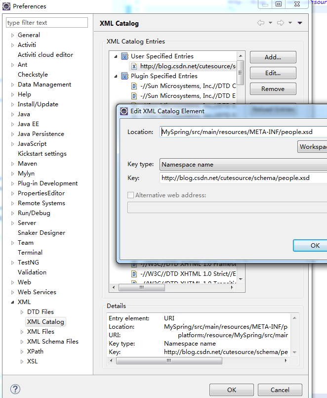

# spring 

## cache
	spring 缓存 ehcache缓存(支持复杂的规则)

## 自定义schema

eclipse 配置提示如图 

## 事务

[事务说明](http://nannan408.iteye.com/blog/1754882) [嵌套事务](http://blog.csdn.net/feng27156/article/details/8534609)